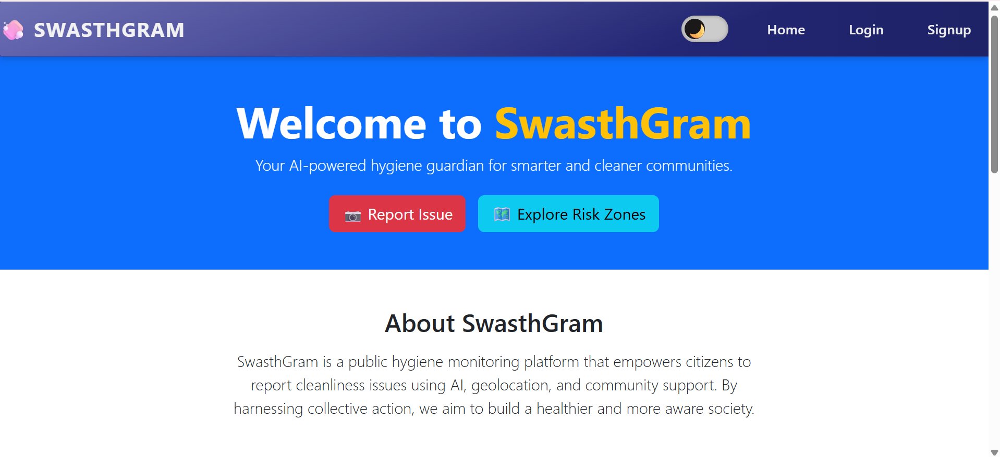

# 🧼 SwasthGram – Community Hygiene Risk Tracker

**SwasthGram** is an AI-powered hygiene monitoring and reporting platform that empowers communities to report sanitation issues and helps public health officials assess environmental health risks.

It bridges the gap between citizens and authorities through real-time data visualization, intelligent analysis, and actionable insights.

---

## 📸 Homepage Preview

## 🌟 Key Features

### 📍 Hygiene Issue Reporting
Citizens can report public hygiene problems such as:
- 🗑️ Garbage Dumps
- 💧 Stagnant Water
- 🚽 Dirty or Broken Toilets  
Each report includes a description, location, and issue type.

### 🗺️ Interactive Hygiene Map
An interactive map displays:
- Reported issues with severity color codes:
  - 🔴 High Risk
  - 🟠 Medium Risk
  - 🟢 Low Risk
- Dengue-prone zones based on clusters of stagnant water

### 🤖 AI-Based Risk Classification
Each report is evaluated by an AI model to classify its **severity** based on:
- Issue type
- Description
- Number of similar complaints  
This helps prioritize the most critical health threats.

### 🧠 Community Health Insight Generator
Using all the reports from a selected area and time frame, the AI generates:
- 3-line summary describing hygiene risk
- Possible health hazards (like dengue, infections)
- Urgency level for intervention

### 📊 Dynamic Filters
Users can filter reports based on:
- Issue type (garbage, water, toilet)
- Time of report (7 days, 30 days, all time)

### 📥 Admin Dashboard & Reporting
Authorities can:
- View all community reports in a table
- Track **status** of reports (Pending / Resolved)
- Export reports to **CSV or PDF** format for offline review

---

## 🧱 Tech Behind the Scenes

- **Frontend**: React.js, Leaflet.js, jsPDF, Bootstrap
- **Backend**: Django REST Framework, JWT Auth
- **Database**: PostgreSQL
- **AI Integration**: OpenRouter AI (Gemini / Mistral models)

---

## 📌 Purpose

SwasthGram aims to:
- Encourage citizen participation in maintaining public hygiene
- Support municipalities with real-time data for better sanitation planning
- Leverage AI to turn raw reports into meaningful public health insights

---

## 📍 Ideal Use Cases

- Local health departments
- Smart city sanitation dashboards
- NGOs working in community health & urban hygiene
- Disaster-prone zones with potential for disease outbreaks

---

## 🧪 Sample AI Insight

> "Multiple garbage and stagnant water complaints reported in the last 7 days near 3rd block. Risk of vector-borne diseases like dengue is high. Immediate cleanup is advised."

---

## 🙋‍♀️ About Me

Hi! I’m **Pravalika Batchu**, a Computer Science undergrad passionate about using tech to solve real-world problems. I enjoy building impactful projects that combine full-stack development, AI integration, and user-focused design.

This project reflects my interest in public health tech, geospatial data, and community-driven solutions.  
Feel free to connect with me on [LinkedIn](https://www.linkedin.com/in/pravalikabatchu) or drop a message if you’re curious about the project!

---
